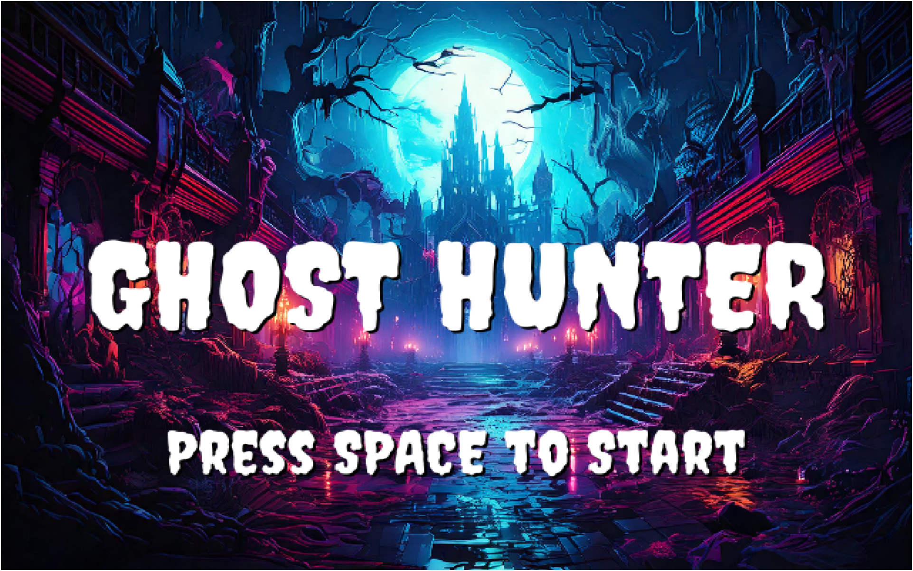
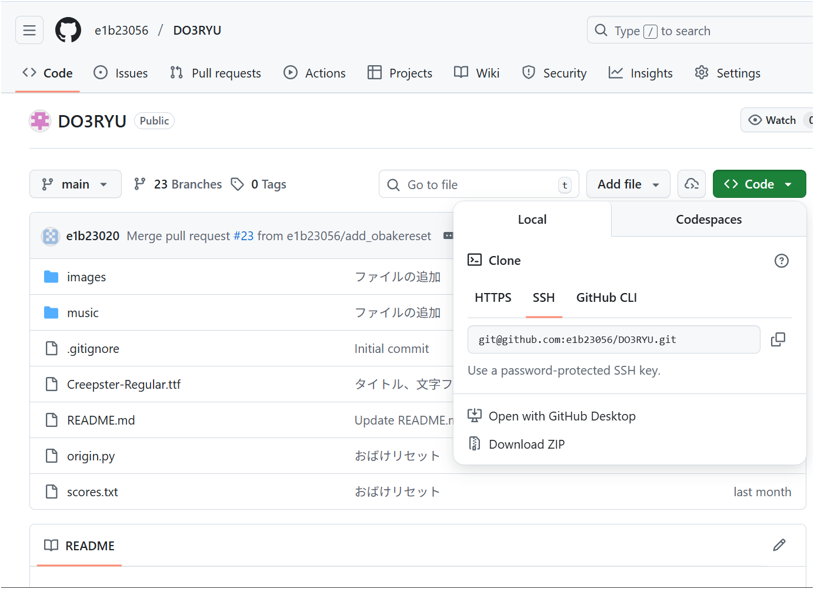

# DO3RYU-GHOST HUNTERとは
このゲームは「Python」というプログラミング言語と「MediaPipe」というカメラで読み取った画像・映像を処理する画像処理ライブラリを組み合わせて作りました！


# セットアップ
### 1.GHOST HUNTERのダウンロード
1.[DO3RYUのリポジトリ](https://github.com/e1b23056/DO3RYU)にアクセスする。
2.下の画像のDolwnload ZIPからzipファイルをダウンロードし、任意の場所に解凍する。



### 2.Pythonのセッティング
1. [VSCodeをインストール](https://code.visualstudio.com/download)
2. [Python3.10.0をインストール ](https://www.python.org/ftp/python/3.10.0/python-3.10.0-amd64.exe )
3. 以下のライブラリをインストールしてください（環境によっては-mがいらなかったりpyではなくpythonで動く可能性もあります）
    ```
    py -m pip install mediapipe opencv-python 
    py -m pip install pygame==2.1.0

    ```


### 3.実行方法
VScodeのターミナル上でorigin.pyを実行してください。


### 4.操作方法
-スペースキーを押すと5秒のカウントダウンの後ゲームがスタートする。
-リザルト画面でスペースキーを押すと最初の画面に戻り、escキーを押すことでゲームを終了する。


### 5.遊び方
-右手が赤色のマーカー、左手が青色のマーカーになっているので、赤色のおばけは赤色のマーカーで、青色のおばけは青色のマーカーで触れて倒そう。緑色のおばけは左右どちらでもOK。
-連続でおばけを倒すとコンボカウントが増えていき、10以上になるとアクティブ状態となっておばけを倒した時の得点が2倍になる。
-制限時間40秒の中でより多くのおばけを倒して得点を稼ごう！ 
